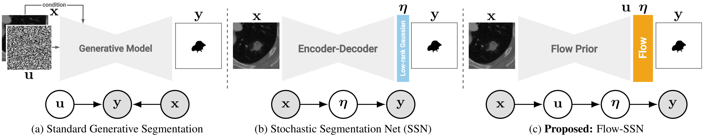

# Flow Stochastic Segmentation Networks (ICCV 2025)



Code for the **ICCV 2025** paper:

>[**Flow Stochastic Segmentation Networks**](https://arxiv.org/abs/2507.18838)\
>Fabio De Sousa Ribeiro, Omar Todd, Charles Jones, Avinash Kori, Raghav Mehta, Ben Glocker\
Imperial College London


### Abstract

We introduce the Flow Stochastic Segmentation Network (Flow-SSN), a generative segmentation model family featuring discrete-time autoregressive and modern continuous-time flow variants. We prove fundamental limitations of the low-rank parameterisation of previous methods and show that Flow-SSNs can estimate arbitrarily high-rank pixel-wise covariances without assuming the rank or storing the distributional parameters. Flow-SSNs are also more efficient to sample from than standard diffusion-based segmentation models, thanks to most of the model capacity being allocated to learning the base distribution of the flow, constituting an expressive prior. We apply Flow-SSNs to challenging medical imaging benchmarks and achieve state-of-the-art results.

### TLDR
 - A flow's prior is typically fixed (e.g. $$N(0, I)$$). We learn it and use a **lightweight** flow to model pixel dependencies;
 - This makes sampling (ODE solving) more efficient, without sacrificing performance in our setting;
 - We introduce bespoke training objectives for both autoregressive and continuous-time flow variants;
 - Flow-SSN achieves SOTA performance on standard stochastic segmentation benchmarks :rocket:

### Getting Started

Core dependencies are declared in `setup.py`. Install the package in editable mode:
```
pip install -e .
```
Already have the dependencies installed and want to skip dependency resolution?

```
pip install -e . --no-deps
```
*Note:* `--no-deps` won’t check versions, use only if you’re confident your environment matches the requirements, or expect runtime errors.

### Download Model Checkpoints

Download pre-trained checkpoints from the following Google Drive links:

| Flow-SSN | LIDC-IDRI | REFUGE-MultiRater |
|----------|:----------:|:----------:|
| Continuous (recommended)    | [Download (160MB)](https://drive.google.com/file/d/1jseipMXHcASEeKEduhgLCLpmB7u364HY/view?usp=sharing)   | [Download (169MB)](https://drive.google.com/file/d/1akmq2t67P4KJxddkmh96m608gOjRS_yc/view?usp=sharing)   |
| Autoregressive    | [Download (165MB)](https://drive.google.com/file/d/1R6wY3h6uT_JXixLqrDa3ZzUFHO5GQBvh/view?usp=sharing)   | [Download (169MB)](https://drive.google.com/file/d/15Za8G2In0Vd_4THFoLxjp4T9TFs4ba1V/view?usp=sharing)   |


### Reproduce Results

LIDC-IDRI:
- Run [notebooks/continuous_lidc.ipynb](notebooks/eval_continuous_lidc.ipynb)
- Run [notebooks/autoregressive_lidc.ipynb](notebooks/eval_autoregressive_lidc.ipynb)

| Flow-SSN |  NFE | MC | GED $\downarrow$ | Diversity $\uparrow$ | HM-IoU $\uparrow$ | Dice $\uparrow$ |
|---------|:-----------------:|:-----------:|:--------:|:--------:|:--------:|:--------:|
| Autoregressive  | - | 100 |0.2118          | 0.5977    | 0.8784 | 0.4705 |
| Continuous   | 50 | 100 |0.1811          | 0.5111    | 0.8721 | 0.6157 |

REFUGE-MultiRater:
- Run [notebooks/continuous_refuge.ipynb](notebooks/eval_continuous_refuge.ipynb)
- Run [notebooks/autoregressive_refuge.ipynb](notebooks/eval_autoregressive_refuge.ipynb)

| Flow-SSN |  NFE | MC | GED $\downarrow$ | Diversity $\uparrow$ | HM-IoU $\uparrow$ | Dice $\uparrow$ |
|---------|:-----------------:|:-----------:|:--------:|:--------:|:--------:|:--------:|
| Autoregressive  | - | 512 |0.0810          | 0.4461    | 0.8808 | 0.8815 |
| Continuous   | 50 | 100 |0.0864          | 0.4341    | 0.8344 | 0.8732 |

### Data

For **LIDC-IDRI**, we follow [PHiSeg](https://github.com/baumgach/PHiSeg-code) and download [Stefan Knegt's pickle file](https://drive.google.com/drive/folders/1xKfKCQo8qa6SAr3u7qWNtQjIphIrvmd5), then run `datasets/lidc.py` to generate the .hdf5 dataset file. The **REFUGE-MultiRater** dataset is available for [download on huggingface](https://huggingface.co/datasets/realslimman/REFUGE-MultiRater).

### Training your own model

Check [/scripts](/scripts) for launch script examples. To launch a training run, enter:
```
bash run_continuous_lidc.sh your_experiment_name
```
We recommend using continuous Flow-SSNs over autoregressive; they are more stable to train and tend to perform better.
